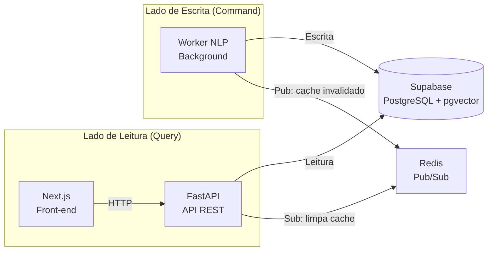
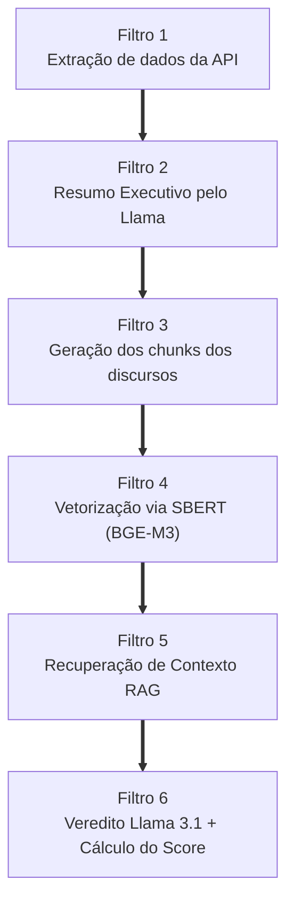

# ADR 002: Segregação de Responsabilidades (CQRS) e Pipeline Linear (Pipe and Filter) no Worker NLP

| Campo | Valor |
|---|---|
| **Data** | 21/05/2026 |
| **Status** | ✅ Aceito (Definido na Sprint 09) |
| **Participantes** | @henriquemendeselias, @jot4-ge, @luizhtmoreira, @G2SBiell, @lucasaraujoszz, @matheus0346 |

---

## 1. Contexto e Problema

A arquitetura RAG (ADR 001) resolveu o problema de precisão semântica, mas manteve um acoplamento crítico na camada de execução: o backend principal (FastAPI) ainda atuava como orquestrador direto das requisições pesadas de IA, gerando três riscos estruturais:

**1.1 Risco de Indisponibilidade (Timeouts e Out of Memory)**

Manter a API web esperando ou gerenciando tarefas pesadas locais (Llama 3.1 8B e embeddings SBERT) abria margem para esgotamento de memória. Um travamento de madrugada derrubaria o portal de consulta dos usuários.

**1.2 Sobrecarga de Abstração no Código**

A equipe debateu a adoção da Arquitetura Hexagonal (Ports and Adapters). Para a realidade de prazos do projeto, essa abordagem introduziria complexidade desnecessária e dificultaria o rastreamento da lógica do Score.

**1.3 Pontos Cegos na Modelagem de Dados**

A estrutura relacional anterior não comportava regras críticas como a barreira temporal de discursos (RN05), a troca de partidos durante a legislatura e a exibição de metadados de atualização na interface.

---

## 2. Decisão Arquitetural

Para garantir resiliência absoluta e simplicidade de código, foram adotadas duas abordagens complementares.

### 2.1 Macroarquitetura: CQRS

O sistema foi dividido física e logicamente em dois serviços independentes, usando o Supabase (PostgreSQL + pgvector) como único meio de comunicação.

| Lado | Serviço | Responsabilidades |
|---|---|---|
| **Query (Leitura)** | FastAPI | Ler dados consolidados, validar parâmetros, entregar JSONs ao Next.js, cache em memória. |
| **Command (Escrita)** | Worker NLP | Executar SBERT, rodar Llama 3 localmente, persistir vereditos e scores no banco. |

### 2.2 Microarquitetura do Worker: Pipe and Filter

O fluxo interno abandona o modelo Hexagonal em favor de um **pipeline procedural, determinístico e linear**. O pacote de dados trafega de forma unidirecional por 6 filtros sequenciais:

---

## 3. Consequências

### Pontos Positivos

- **Resiliência:** Falha ou timeout no Worker fica restrita ao seu contêiner. A FastAPI continua servindo os dados da última execução bem-sucedida.
- **Manutenibilidade:** O pipeline linear facilita o debug — se o score de um político divergir, a equipe isola o erro testando as funções sequencialmente, sem camadas de abstração.
- **Performance de Leitura:** A FastAPI executa queries SQL diretas em tabelas indexadas. O tempo de resposta ao Next.js cai para milissegundos, pois nenhum cálculo vetorial ocorre em tempo de request do usuário.

### Trade-offs

!!! warning "Consistência Eventual"
    Os dados do portal não são em tempo real. O Score de um político só é atualizado após o fechamento da esteira do Worker.

!!! note "Invalidação Ativa de Cache"
    Ao término do processamento, o Worker publica um sinal no Redis. A FastAPI (subscriber) limpa o cache em memória, garantindo que o Next.js receba os dados recém-processados no próximo request.