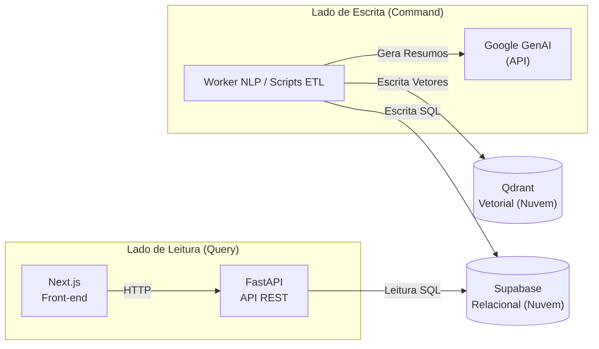

# ADR 003: Migração para Qdrant, Integração de Google GenAI, Simplificação da Infraestrutura e Descontinuação do Score de Coerência

| Campo | Valor |
|---|---|
| **Data** | 17/06/2026 |
| **Status** | ✅ Aceito (Definido na Sprint 11) |
| **Participantes** | @henriquemendeselias, @jot4-ge, @luizhtmoreira, @G2SBiell, @lucasaraujoszz, @matheus0346 |

---

## 1. Contexto e Problema

Com a evolução do projeto e a necessidade de viabilizar a entrega final dentro dos prazos acadêmicos, a equipe identificou gargalos críticos na arquitetura definida anteriormente (ADR 002):

**1.1 Limitação do pgvector no Supabase**
O armazenamento e indexação de vetores de alta dimensão (`BAAI/bge-m3` com 1024 dimensões) no banco relacional Supabase começou a apresentar problemas de escalabilidade e performance na camada gratuita, além de acoplamento excessivo na mesma base de dados.

**1.2 Viabilidade de Tempo para o Score de Coerência**
Embora a equipe tenha coletado os dados necessários, o pipeline de inferência local completo com o Llama 3.1 8B era inviável de rodar sob restrições de tokens, recursos de hardware e escopo de entrega do semestre.

**1.3 Complexidade de Infraestrutura (Redis e Cron)**
A orquestração do Redis para invalidação de cache e a execução do worker via Cron Jobs/Celery aumentavam o tamanho da infraestrutura local (Docker footprint), dificultando a execução e o deploy rápido da aplicação.

---

## 2. Decisão Arquitetural

Para simplificar a implantação, garantir a entrega do produto e otimizar a escalabilidade, foram tomadas as seguintes decisões:

### 2.1 Separação Física dos Bancos de Dados
*   **Supabase (Nuvem):** Mantido exclusivamente para persistência dos dados relacionais (parlamentares, proposições, discursos limpos, votos e metadados de vinculação). O `pgvector` foi descontinuado do projeto.
*   **Qdrant (Nuvem):** Adotado como banco vetorial dedicado na nuvem. Responsável exclusivo por armazenar e indexar os embeddings dos fragmentos de discursos e resumos legislativos.

### 2.2 Substituição de Modelos Locais por API do Google GenAI
A inferência local do Llama 3.1 8B foi completamente removida. O sistema agora consome a API do **Google GenAI** (Gemini) de forma pontual para a sumarização temática das proposições legislativas. A vetorização continua local utilizando o SBERT (`BAAI/bge-m3`).

### 2.3 Descontinuação do Score de Coerência
O cálculo do *Score de Coerência* e seus vereditos de IA associados foram descontinuados devido à falta de viabilidade de tempo para processamento de inferência e validação dos resultados gerados. O front-end e a API passaram a focar em outras métricas analíticas calculadas em tempo de consulta (como afinidades gêmeo/antípoda, fidelidade partidária, coesão partidária e polarização).

### 2.4 Simplificação da Infraestrutura (Remoção do Redis)
O Redis foi removido do ecossistema. A API FastAPI passa a utilizar cache exclusivamente em memória (`InMemoryBackend`) com TTL curto. A comunicação entre o pipeline de ETL e a API tornou-se assíncrona e indireta, ocorrendo unicamente através da leitura de dados no Supabase.

### 2.5 Execução Procedural por Pipelines de Script
O container do worker deixa de rodar um daemon contínuo com Cron/Celery. Ele passou a atuar como ambiente isolado que executa scripts e pipelines Python específicos (ETL e run scripts) disparados conforme demanda.

---

## 3. Consequências

### Pontos Positivos

*   **Infraestrutura Leve:** Docker Compose reduzido ao mínimo necessário para desenvolvimento local (Front, API, Worker e MkDocs), eliminando consumo de RAM pelo Redis e o download local de pesos pesados de LLM (~2.3GB).
*   **Entrega Viável:** A simplificação do escopo permitiu entregar métricas analíticas e de alinhamento político de alta fidelidade sem atrasar o cronograma de fechamento do projeto.
*   **Segregação de Dados Limpa:** Divisão lógica clara entre dados relacionais de negócio (Supabase) e dados geométricos vetoriais (Qdrant).

### Trade-offs

*   **Dependência Externa:** O pipeline depende da disponibilidade da nuvem do Qdrant e da API do Google GenAI para sumarização.
*   **Fim do Score de Coerência:** A proposta inicial de gerar um score percentual único baseado em IA foi substituída pelas métricas nativas do Congresso, o que reduziu a complexidade de verificação de alinhamento por IA e focou na transparência dos votos nominais em si.