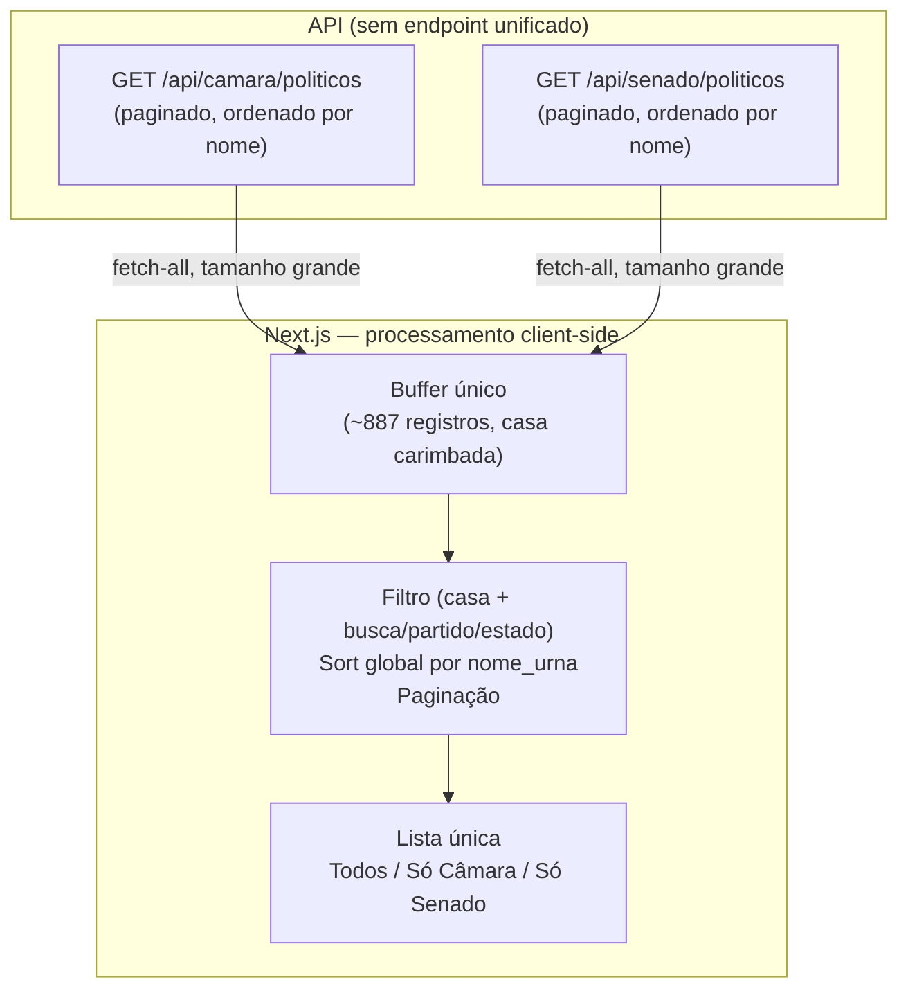
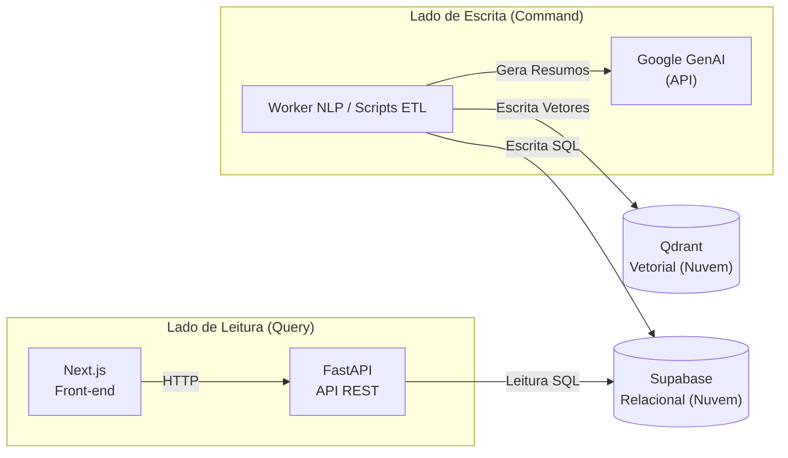

# ADR 003: Simplificação da Infraestrutura (Qdrant, Gemini, Fim do Score de Coerência) e Diretório Unificado com Paginação Client-Side

| Campo | Valor |
|---|---|
| **Data** | 17/06/2026 (Infraestrutura) e 25/06/2026 (Diretório) |
| **Status** | ✅ Aceito (Sprints 11 e 12) |
| **Participantes** | @henriquemendeselias, @jot4-ge, @luizhtmoreira, @G2SBiell, @lucasaraujoszz, @matheus0346 |

---

## 1. Contexto e Problema

**1.1 Limitação do pgvector no Supabase e Descontinuação do Score de Coerência**
Com a evolução do projeto e a necessidade de viabilizar a entrega final dentro dos prazos acadêmicos, a equipe identificou gargalos críticos na arquitetura de IA definida anteriormente (ADR 002):
- **pgvector no Supabase:** O armazenamento e indexação de vetores de alta dimensão (`BAAI/bge-m3` com 1024 dimensões) no banco relacional Supabase começou a apresentar problemas de escalabilidade e performance na camada gratuita, além de acoplamento excessivo na mesma base de dados.
- **Viabilidade de Tempo do Score de Coerência:** Embora a equipe tenha coletado os dados necessários, o pipeline de inferência local completo com o Llama 3.1 8B era inviável de rodar sob restrições de tokens, recursos de hardware e escopo de entrega do semestre.
- **Complexidade de Infraestrutura:** A orquestração do Redis para invalidação de cache e a execução do worker via Cron Jobs/Celery aumentavam o tamanho da infraestrutura local (Docker footprint), dificultando a execução e o deploy rápido da aplicação.

**1.2 Virada de Produto e o Desafio da Rota `/diretorio`**
Com a virada de produto de *ranking de coerência* para **portal de consulta**, a rota **`/diretorio`** passou a exibir os parlamentares da Câmara e do Senado numa lista única com três modos de visualização (**Todos / Só Câmara / Só Senado**). A Home (`/`) atua apenas como vitrine/preview e navega para `/diretorio`. 

A API, porém, não oferece um endpoint unificado: existem `GET /api/camara/politicos` e `GET /api/senado/politicos`, cada um paginado e ordenado por `nome_urna` de forma independente dentro da própria casa legislativa.

Tentar mesclar as duas fontes página a página no servidor não produz uma lista única corretamente ordenada pelos seguintes motivos:
- **Sort global impossível:** a página 1 da Câmara traz nomes A–F e a página 1 do Senado traz A–G; se apenas concatenadas, resultam em `A–F, A–G`, e não numa ordem alfabética global. A ordenação global só é possível com todos os registros em mãos.
- **Fronteiras de página desalinhadas:** 20 registros de uma casa + 20 de outra viram uma "página" de 40 no cliente, com dois valores de `total_paginas` e dois de `total_registros` a reconciliar de forma complexa.

Como o dataset é pequeno (Câmara 642 + Senado 245 = **887 registros** de campos leves com dados reais do Supabase em 25/06/2026) e os endpoints de listagem têm cache de 1h no servidor, uma nova abordagem de processamento se tornou viável.

---

## 2. Decisão Arquitetural

Para simplificar a implantação, garantir a entrega do produto, otimizar a escalabilidade e viabilizar a visualização unificada no frontend, foram tomadas as seguintes decisões:

### 2.1 Separação Física dos Bancos de Dados
*   **Supabase (Nuvem):** Mantido exclusivamente para persistência dos dados relacionais (parlamentares, proposições, discursos limpos, votos e metadados de vinculação). O `pgvector` foi descontinuado do projeto.
*   **Qdrant (Nuvem):** Adotado como banco vetorial dedicado na nuvem. Responsável exclusivo por armazenar e indexar os embeddings dos fragmentos de discursos e resumos legislativos.

### 2.2 Substituição de Modelos Locais por API do Google GenAI
A inferência local do Llama 3.1 8B foi completamente removida. O sistema agora consome a API do **Google GenAI** (Gemini) de forma pontual para a sumarização temática das proposições legislativas. A vetorização continua local utilizando o SBERT (`BAAI/bge-m3`).

### 2.3 Descontinuação do Score de Coerência
O cálculo do *Score de Coerência* e seus vereditos de IA associados foram descontinuados devido à falta de viabilidade de tempo para processamento de inferência e validação dos resultados gerados, onde a equipe decidiu deixa o Score de Coerência para posteriormente. O front-end e a API passaram a focar em outras métricas analíticas calculadas em tempo de consulta (como afinidades gêmeo/antípoda, fidelidade partidária, coesão partidária e polarização).

### 2.4 Simplificação da Infraestrutura (Remoção do Redis)
O Redis foi removido do ecossistema. A API FastAPI passa a utilizar cache exclusivamente em memória (`InMemoryBackend`) com TTL curto. A comunicação entre o pipeline de ETL e a API tornou-se assíncrona e indireta, ocorrendo unicamente através da leitura de dados no Supabase.

### 2.5 Execução Procedural por Pipelines de Script
O container do worker deixa de rodar um daemon contínuo com Cron/Celery. Ele passou a atuar como ambiente isolado que executa scripts e pipelines Python específicos (ETL e run scripts) disparados conforme demanda.

### 2.6 Buffer de Dados e Processamento Client-Side para o Diretório
Carregar o roster completo de ambas as casas **uma única vez** para um buffer no client e executar **todo o processamento no front-end**: escopo por casa (onde o toggle vira apenas um filtro do buffer), filtros (busca textual, partido, estado), sort global por `nome_urna` e paginação.
Isso estabelece um caminho de código único e uniforme nos três modos de visualização. O campo `casa` é carimbado em cada registro no momento do fetch (já que o endpoint de origem conhece a casa, embora o payload do Supabase não o ecoasse), e a identidade estável do parlamentar passa a ser o par **(casa, id)**.

O fluxo geral de leitura e escrita unificado do sistema passa a ser:

---

## 3. Consequências

### Pontos Positivos

*   **Infraestrutura Leve:** Docker Compose reduzido ao mínimo necessário para desenvolvimento local (Front, API, Worker e MkDocs), eliminando consumo de RAM pelo Redis e o download local de pesos pesados de LLM (~2.3GB).
*   **Entrega Viável:** A simplificação do escopo permitiu entregar métricas analíticas e de alinhamento político de alta fidelidade sem atrasar o cronograma de fechamento do projeto.
*   **Segregação de Dados Limpa:** Divisão lógica clara entre dados relacionais de negócio (Supabase) e dados geométricos vetoriais (Qdrant).
*   **Lista verdadeiramente unificada:** O modo "Todos" entrega uma lista única e globalmente ordenada, impossível de obter via mesclagem de paginação no servidor.
*   **Interação instantânea:** O toggle de casa e os filtros operam sobre o buffer já carregado — sem necessidade de novo fetch na rede e sem necessidade de *debounce*.
*   **Código simples:** Um único caminho de dados unificado para os três modos, eliminando casos especiais complexos para a visualização "Todos".

### Trade-offs

*   **Dependência Externa:** O pipeline depende da disponibilidade da nuvem do Qdrant e da API do Google GenAI para sumarização.
*   **Fim do Score de Coerência:** A proposta inicial de gerar um score percentual único baseado em IA foi substituída pelas métricas nativas do Congresso, o que reduziu a complexidade de verificação de alinhamento por IA e focou na transparência dos votos nominais em si.
*   **Carga inicial maior no Client:** Em vez de paginação preguiçosa por demanda de página, o cliente paga um custo inicial fazendo requisições de todos os registros das duas casas (~887 registros). Esse custo é amortizado pelo cache de 1h configurado nos endpoints de listagem no servidor.
*   **Limite de escala:** A decisão pressupõe um conjunto de dados pequeno e estável (uma legislatura). Se o volume crescer muito no futuro (ex.: histórico de múltiplas legislaturas, dezenas de milhares de registros), será necessário migrar para paginação e ordenação centralizadas no servidor.
