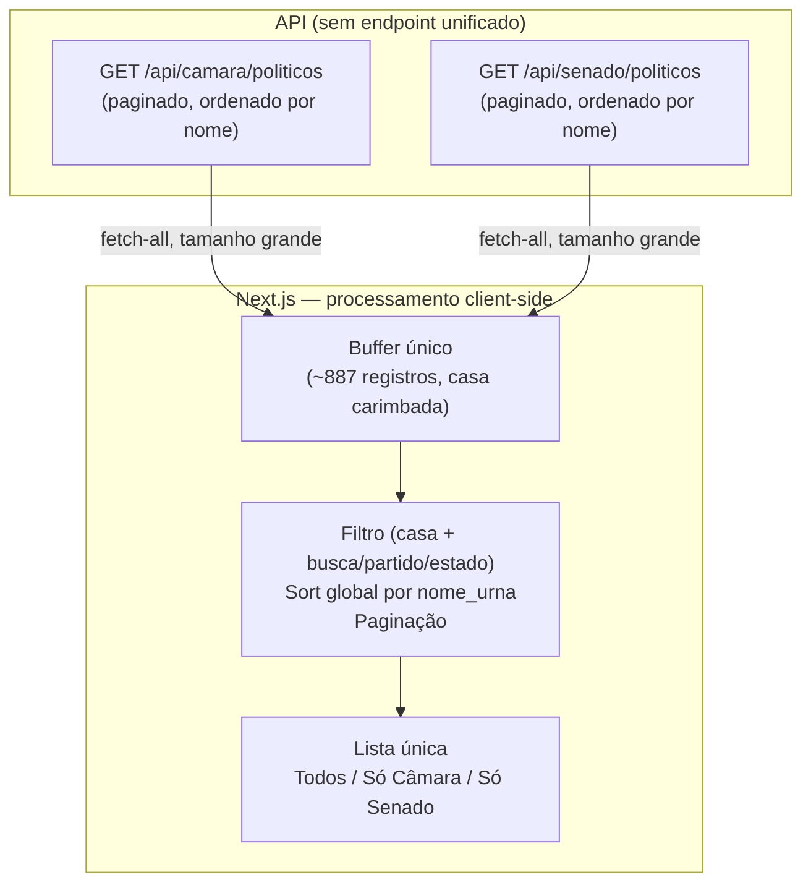

# ADR 003: Diretório Unificado da Home com Fetch-All e Paginação Client-Side

| Campo | Valor |
|---|---|
| **Data** | 25/06/2026 |
| **Status** | ✅ Aceito (Reestruturação do Frontend — Portal de Consulta) |
| **Participantes** | @henriquemendeselias, @jot4-ge, @luizhtmoreira, @G2SBiell, @lucasaraujoszz, @matheus0346 |

---

## 1. Contexto e Problema

Com a virada de produto de *ranking de coerência* para **portal de consulta**, a Home
passou a exibir Câmara e Senado numa lista única com três modos de visualização
(**Todos / Só Câmara / Só Senado**). A API, porém, não oferece endpoint unificado:
existem `GET /api/camara/politicos` e `GET /api/senado/politicos`, cada um **paginado
e ordenado por `nome_urna` de forma independente** dentro da própria casa.

Tentar mesclar as duas fontes página a página no servidor não produz uma lista única
corretamente ordenada:

- **Sort global impossível:** a página 1 da Câmara traz nomes A–F e a página 1 do
  Senado traz A–G; concatenadas, resultam em `A–F, A–G`, e não numa ordem alfabética
  global. Só é possível ordenar globalmente com todos os registros em mãos.
- **Fronteiras de página desalinhadas:** 20 + 20 viram uma "página" de 40, com dois
  `total_paginas` e dois `total_registros` a reconciliar.

O dataset é pequeno: Câmara 642 + Senado 245 = **887 registros** de campos leves
(números reais do Supabase, 2026-06-25), e os endpoints de listagem têm cache de 1h no
servidor.

---

## 2. Decisão Arquitetural

Carregar o roster completo das duas casas **uma única vez** para um buffer no client e
executar **todo o processamento no front-end**: escopo por casa (o toggle vira filtro
do buffer), filtros (busca/partido/estado), sort global por `nome_urna` e paginação.
Caminho de código único e uniforme nos três modos. O campo `casa` é carimbado em cada
registro no momento do fetch (o endpoint conhece a casa; o payload não a ecoa), e a
identidade estável do parlamentar passa a ser o par **(casa, id)**.

---

## 3. Consequências

### Pontos Positivos

- **Lista verdadeiramente unificada:** o modo "Todos" entrega uma lista única e
  globalmente ordenada, impossível via mesclagem página a página.
- **Interação instantânea:** o toggle de casa e os filtros operam sobre o buffer já
  carregado — sem refetch e sem necessidade de *debounce*.
- **Código simples:** um único caminho de dados para os três modos, sem caso especial
  para "Todos".

### Trade-offs

!!! warning "Carga inicial maior"
    Em vez de paginação preguiçosa por página, paga-se uma carga inicial de múltiplas
    requisições (~887 registros). O custo é amortizado pelo cache de 1h dos endpoints
    de listagem no servidor.

!!! note "Limite de escala"
    A decisão pressupõe um dataset pequeno e estável. Se o volume crescer muito (ex.:
    histórico de várias legislaturas, milhares de registros), será necessário revisitar
    em favor de paginação e ordenação no servidor.
