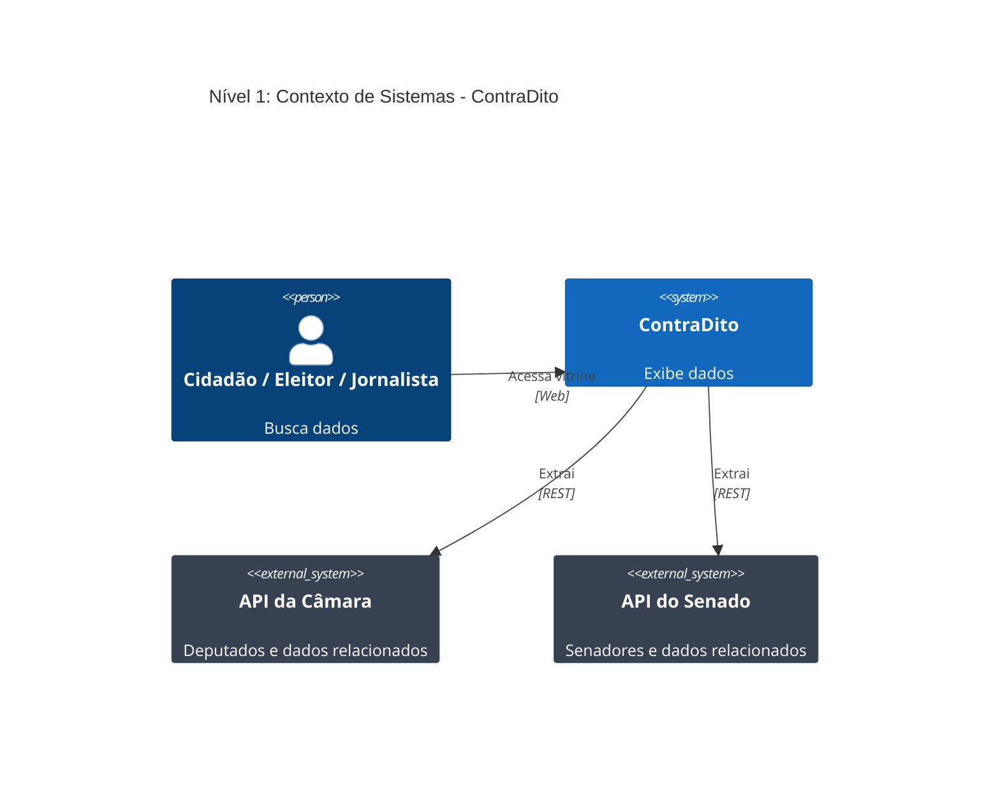
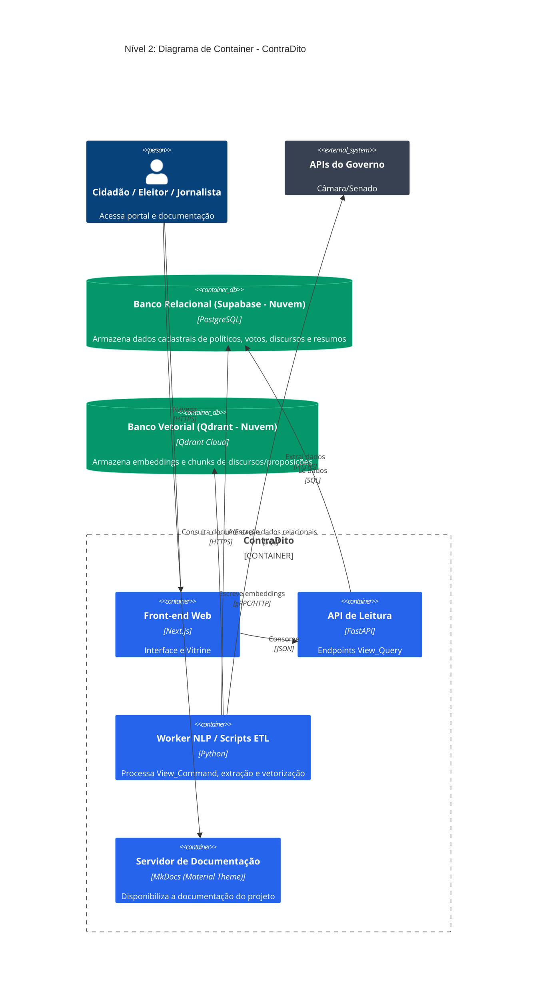
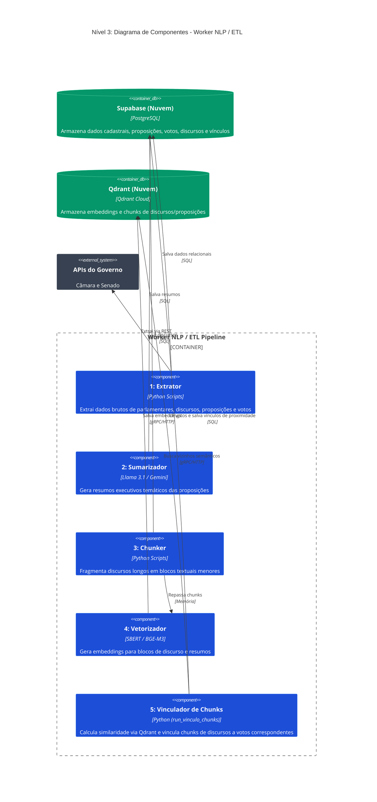
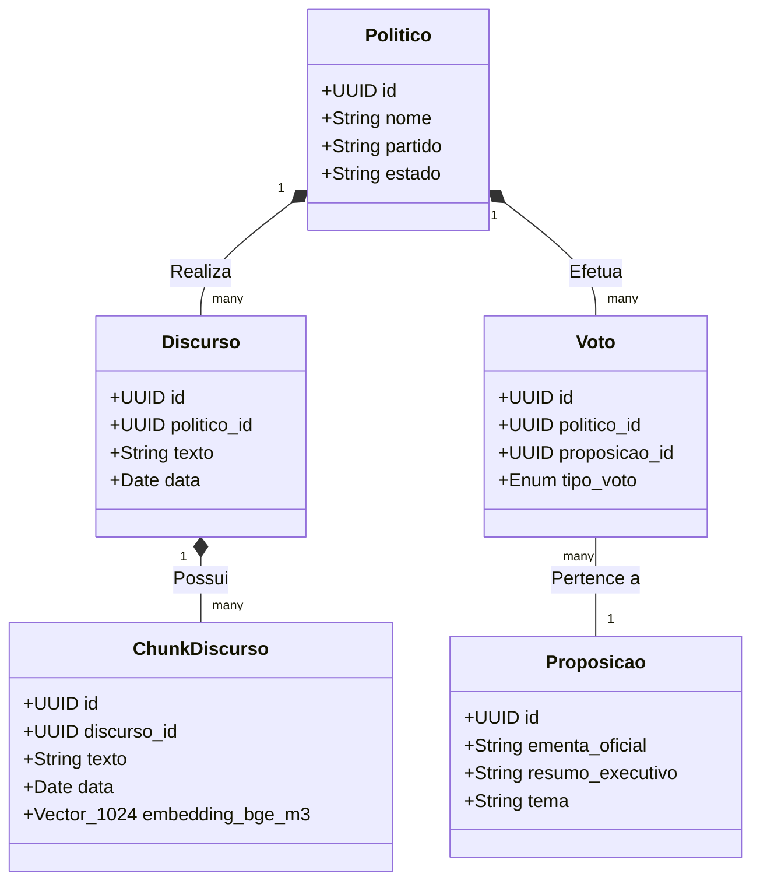

# Visão Geral da Arquitetura

A arquitetura do **ContraDito** foi desenhada com foco em resiliência absoluta e simplicidade estrutural, separando rigorosamente o processamento de inteligência artificial da entrega de dados ao usuário final.

---

## 1. Visão Arquitetural: C4 Model

Para garantir clareza e transparência no fluxo de processamento e arquitetura do ContraDito, utilizamos o modelo C4 para documentar os diferentes níveis de abstração do sistema.

### Nível 1: C4 Context (Sistema e Usuário)
O diagrama de Contexto mostra a visão de "helicóptero" de como a plataforma interage com o usuário final e sistemas externos (governamentais).

### Nível 2: C4 Container (Aplicações e Dados)
O diagrama de Container detalha a Plataforma ContraDito em seus serviços independentes, evidenciando o padrão arquitetural CQRS que isola leitura de processamento, e especificando que os bancos relacional e vetorial residem na nuvem como serviços gerenciados.

### Nível 3: C4 Component (Worker NLP)
Focando nos scripts e pipelines de processamento do backend — o **Worker NLP / Scripts ETL** —, este diagrama ilustra o fluxo de dados em formato de Pipe and Filter para a extração de dados, sumarização, fragmentação, vetorização e vinculação de proximidade semântica.

### Nível 4: C4 Code (Diagrama de Classes de Domínio)
O modelo de classes a seguir apresenta as principais estruturas de domínio que trafegam pelo motor NLP até persistirem no banco de dados para consumo posterior.

---

## 2. Macroarquitetura: CQRS

O sistema é dividido física e logicamente em dois lados independentes que não realizam chamadas diretas ou comunicação síncrona entre si, utilizando o **Supabase (PostgreSQL)** e o **Qdrant (Banco Vetorial)** como meios de persistência e acoplamento indireto de dados.

| | Lado de Leitura (Query — FastAPI) | Lado de Escrita (Command — Worker/ETL) |
|---|---|---|
| **Tipo** | API REST para consultas e agregação de métricas em tempo de execução | Conjunto de scripts e pipelines Python executados em contêiner isolado |
| **Responsabilidades** | Ler dados consolidados do Supabase e entregar JSONs estruturados ao front-end | Extração das APIs governamentais, fragmentação de textos, geração de embeddings com SBERT e geração de resumos executivos via Google GenAI |
| **Cache** | Opera com respostas cacheadas em memória (FastAPICache) | Não se aplica (persistência direta nos bancos de dados) |
| **Resiliência** | Continua servindo o portal mesmo se o Worker/ETL estiver inativo ou falhar | As falhas do pipeline ficam restritas ao contêiner do Worker, sem qualquer impacto na API principal |

---

## 3. Microarquitetura do Worker: Pipe and Filter

Para o processamento interno do Worker NLP, a arquitetura abandona abstrações complexas e segue um fluxo procedural, determinístico e linear. O pacote de dados trafega de forma unidirecional por 6 estágios sequenciais:

1. **Filtro 1 — Extração (API):** Consumo das APIs federais para capturar perfis, proposições validadas e discursos.
2. **Filtro 2 — Sumarização:** Submissão da proposição legislativa para a API do Google GenAI para geração de um resumo executivo coeso.
3. **Filtro 3 — Fragmentação (Chunking):** Divisão dos discursos limpos em *chunks* textuais com sobreposição, preparando a carga para modelos com limite de contexto estrito.
4. **Filtro 4 — Vetorização:** Geração de embeddings com SBERT ( BAAI/bge-m3 ) para chunks e resumos.
5. **Filtro 5 — Armazenamento Vetorial:** Envio e indexação dos chunks com seus vetores no Qdrant.
6. **Filtro 6 — Vinculação de Chunks a Votos:** Execução do mecanismo de similaridade vetorial comparando discursos do Qdrant e associando-os aos votos no Supabase.
---

## 4. Stack Tecnológica

A tabela a seguir consolida as principais tecnologias que compõem o ecossistema do **ContraDito**, agrupadas por camada de atuação:

| Camada / Componente | Tecnologia | Função |
| :--- | :--- | :--- |
| **Front-end** | React, Next.js, Tailwind CSS | Interface interativa, roteamento da aplicação web e estilização visual. |
| **API de Leitura** | FastAPI | Camada REST para entrega rápida e cacheada dos dados (CQRS - *Query*). |
| **Banco de Dados** | Supabase (PostgreSQL), Qdrant Cloud | Supabase para persistência relacional de políticos/votos/discursos e Qdrant para armazenamento/busca vetorial de embeddings. |
| **Extração e Processamento (ETL)** | Regex, BeautifulSoup4, `pdfplumber` | Coleta governamental, limpeza textual rigorosa e extração de PDFs legislativos. |
| **Inteligência Artificial** | Google GenAI (Gemini), `BAAI/bge-m3` (SBERT) | Google GenAI para sumarização temática de proposições e SBERT para vetorização de textos e busca semântica. |