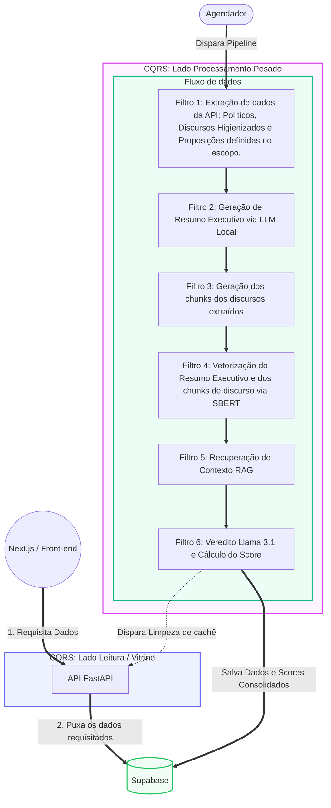

# Visão Geral da Arquitetura

A arquitetura do **ContraDito** foi desenhada com foco em resiliência absoluta e simplicidade estrutural. Para atingir esses objetivos, o sistema adota duas abordagens complementares que separam rigorosamente as responsabilidades de processamento de inteligência artificial da entrega de dados para o usuário final.

## 1. Diagrama Arquitetural

O diagrama abaixo ilustra o fluxo de dados do sistema, desde a solicitação do usuário até o pipeline de processamento assíncrono.

## 2. Macroarquitetura: CQRS (Command Query Responsibility Segregation)

O sistema é dividido física e logicamente em dois serviços independentes que não realizam chamadas HTTP diretas entre si, utilizando o banco de dados (Supabase/PostgreSQL com `pgvector`) como único meio de persistência e comunicação indireta.

### 2.1. Lado de Leitura (Query — FastAPI)
Uma API REST desenhada estritamente para consultas de altíssima performance, isolada da complexidade da inteligência artificial.

* **Responsabilidades:** Ler dados já processados e consolidados, fornecer paginação rápida, validar parâmetros de busca via componentes fechados e entregar JSONs enxutos ao front-end.
* **Performance e Invalidação Ativa:** A FastAPI opera majoritariamente com respostas cacheadas em memória. Ao final de cada ciclo do Worker NLP, a API recebe um comando administrativo assíncrono para limpar o cache, garantindo que os usuários tenham acesso imediato aos dados recém processados.

### 2.2. Lado de Escrita/Processamento (Command — Worker NLP)
Serviço Python isolado que atua em *background*, executado de forma assíncrona por rotinas agendadas (Cron Jobs).

* **Responsabilidades:** Lidar com toda a carga computacional intensiva do ecossistema, incluindo a extração de dados brutos das APIs governamentais, comunicação vetorial com o SBERT e inferência local do Llama 3.1 8B.
* **Resiliência e Tolerância a Falhas:** Caso ocorra lentidão ou esgotamento de memória no modelo de linguagem, o erro fica completamente restrito ao contêiner do Worker NLP. Como não há vínculo direto em tempo de execução, a API Principal continua no ar servindo o portal sem instabilidades.

----
## 3. Microarquitetura do Worker: Pipe and Filter

Para o processamento dos dados no Worker NLP, a arquitetura interna abandona abstrações complexas e segue um fluxo estritamente procedural, determinístico e linear através do padrão de design **Pipe and Filter**.

O pacote de dados trafega de forma unidirecional por 6 estágios de processamento sequenciais. A saída processada de um filtro atua obrigatoriamente como dado de entrada do próximo filtro:

1. **Filtro 1 (Extração API):** Consumo das APIs federais para resgatar os perfis dos políticos, suas proposições validadas no escopo e seus discursos, aplicando imediatamente a higienização textual.
2. **Filtro 2 (Sumarização):** Submissão da ementa legislativa recém-capturada ao Llama 3.1 local para a geração de um resumo executivo coeso.
3. **Filtro 3 (Fragmentação):** Divisão dos discursos limpos em pequenos *chunks* textuais com sobreposição, preparando a carga para modelos com limite de contexto estrito.
4. **Filtro 4 (Vetorização):** Transformação em *embeddings* vetoriais gerados através do modelo SBERT, parametrizando tanto os fragmentos do discurso quanto o resumo da matéria legislativa.
5. **Filtro 5 (Recuperação Contextual RAG):** Busca espacial efetuada pelo Supabase via distância de cosseno. O sistema pinça apenas os fragmentos discursivos que dialogam com a proposta avaliada.
6. **Filtro 6 (Inferência e Veredito):** Orquestração dos dados filtrados para envio ao LLM, determinando se a ação parlamentar foi Coerente ou Incoerente, além do armazenamento consolidado dos scores de volta ao banco de dados.
