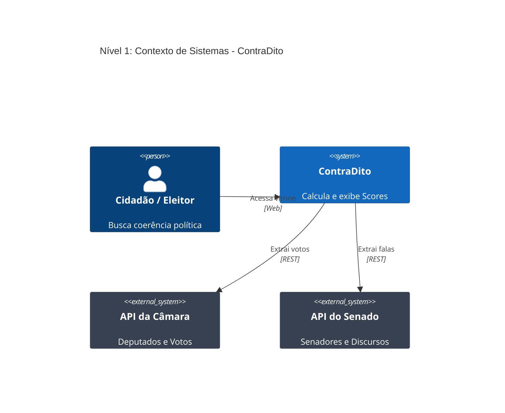
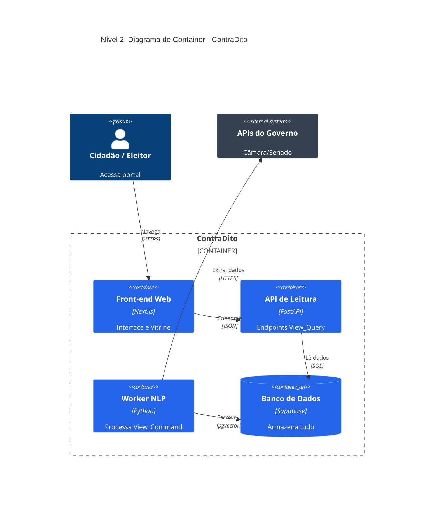
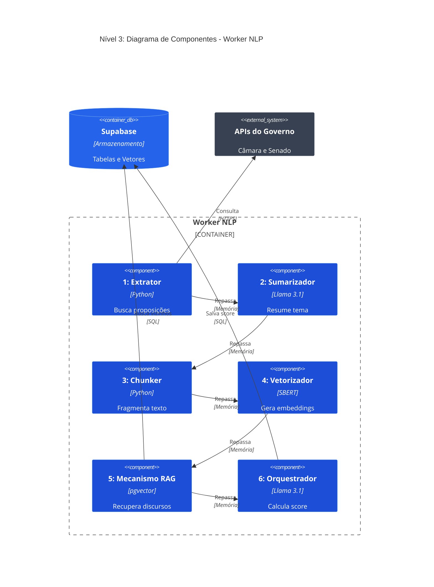
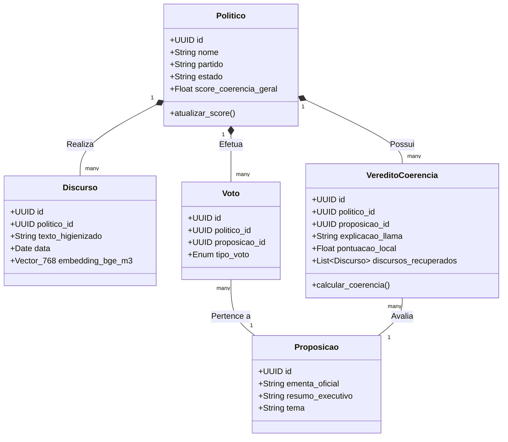

# Visão Geral da Arquitetura

A arquitetura do **ContraDito** foi desenhada com foco em resiliência absoluta e simplicidade estrutural, separando rigorosamente o processamento de inteligência artificial da entrega de dados ao usuário final.

---

## 1. Visão Arquitetural: C4 Model

Para garantir clareza e transparência no fluxo de processamento e arquitetura do ContraDito, utilizamos o modelo C4 para documentar os diferentes níveis de abstração do sistema.

### Nível 1: C4 Context (Sistema e Usuário)
O diagrama de Contexto mostra a visão de "helicóptero" de como a plataforma interage com o usuário final e sistemas externos (governamentais).

### Nível 2: C4 Container (Aplicações e Dados)
O diagrama de Container detalha a Plataforma ContraDito em seus serviços independentes, evidenciando o padrão arquitetural CQRS que isola leitura de processamento.

### Nível 3: C4 Component (Worker NLP)
Focando no serviço mais complexo do backend — o **Worker NLP** —, este diagrama ilustra o padrão Pipe and Filter para a extração, sumarização e cálculo de coerência.

### Nível 4: C4 Code (Diagrama de Classes de Domínio)
O modelo de classes a seguir apresenta as principais estruturas de domínio que trafegam pelo motor NLP até persistirem no banco de dados para consumo posterior.

---

## 2. Macroarquitetura: CQRS

O sistema é dividido física e logicamente em dois serviços independentes que não realizam chamadas HTTP diretas entre si, usando o Supabase (PostgreSQL + `pgvector`) como único meio de persistência e comunicação indireta.

| | Lado de Leitura (Query — FastAPI) | Lado de Escrita (Command — Worker NLP) |
|---|---|---|
| **Tipo** | API REST para consultas de alta performance | Serviço Python isolado, executado em background via Cron Jobs |
| **Responsabilidades** | Ler dados consolidados, paginar, validar parâmetros, entregar JSONs ao front-end | Extração de APIs governamentais, comunicação com SBERT, inferência local do Llama 3.1 8B |
| **Cache** | Opera com respostas cacheadas em memória | Ao final de cada ciclo, publica sinal de invalidação de cache via Redis |
| **Resiliência** | Continua servindo o portal mesmo se o Worker falhar | Falhas ficam restritas ao contêiner do Worker — sem impacto na API principal |

---

## 3. Microarquitetura do Worker: Pipe and Filter

Para o processamento interno do Worker NLP, a arquitetura abandona abstrações complexas e segue um fluxo **estritamente procedural, determinístico e linear**. O pacote de dados trafega de forma unidirecional por 6 estágios sequenciais — a saída de um filtro é obrigatoriamente a entrada do próximo:

1. **Filtro 1 — Extração (API):** Consumo das APIs federais para capturar perfis, proposições validadas e discursos, com higienização textual imediata.
2. **Filtro 2 — Sumarização:** Submissão da ementa legislativa ao Llama 3.1 local para geração de um resumo executivo coeso.
3. **Filtro 3 — Fragmentação (Chunking):** Divisão dos discursos limpos em *chunks* textuais com sobreposição, preparando a carga para modelos com limite de contexto estrito.
4. **Filtro 4 — Vetorização:** Transformação em *embeddings* vetoriais via SBERT (modelo `BAAI/bge-m3`), parametrizando tanto os fragmentos de discurso quanto o resumo legislativo.
5. **Filtro 5 — Recuperação Contextual (RAG):** Busca espacial no Supabase via distância de cosseno — apenas fragmentos discursivos semanticamente próximos à proposição avaliada são selecionados.
6. **Filtro 6 — Inferência e Veredito:** Orquestração dos dados filtrados para envio ao LLM, determinando a coerência ou incoerência do voto e armazenando os scores consolidados no banco.

---

## 4. Stack Tecnológica

A tabela a seguir consolida as principais tecnologias que compõem o ecossistema do **ContraDito**, agrupadas por camada de atuação:

| Camada / Componente | Tecnologia | Função |
| :--- | :--- | :--- |
| **Front-end** | React, Next.js, Tailwind CSS | Interface interativa, roteamento da aplicação web e estilização visual. |
| **API de Leitura** | FastAPI | Camada REST para entrega rápida e cacheada dos dados (CQRS - *Query*). |
| **Banco de Dados** | Supabase, PostgreSQL, HNSW, `pgvector` | Persistência relacional, indexação avançada e suporte estrutural à busca vetorial. |
| **Extração (ETL)** | Regex, BeautifulSoup4, `pdfplumber`, Celery, Redis | Coleta governamental, limpeza textual rigorosa, extração de PDFs e orquestração de rotinas automatizadas em *background*. |
| **Inteligência Artificial** | Llama 3.1 8B, `BAAI/bge-m3`, LangChain| Processamento e vetorização de textos, busca semântica, orquestração do fluxo RAG e inferência contextual.|