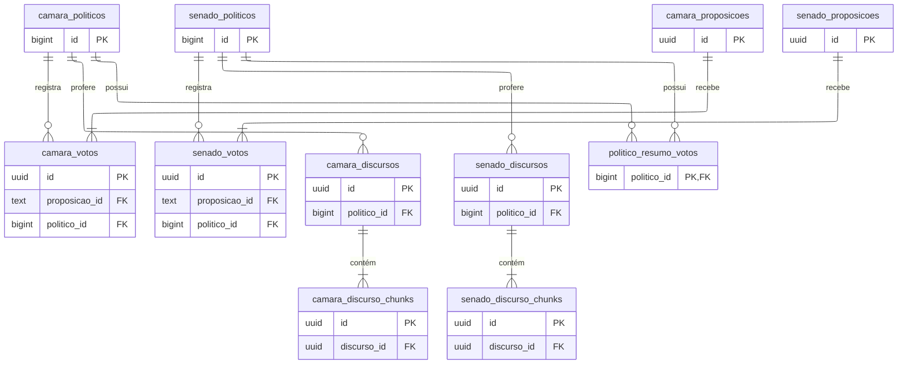

# Modelagem do Supabase

O modelo do banco relacional (Supabase/PostgreSQL) foi desenhado para suportar o padrão **CQRS**, estruturando de forma normalizada os dados cadastrais, proposições, discursos e votos nominais coletados.

---

## 1. Banco Relacional (Supabase / PostgreSQL)

O modelo relacional do Supabase gerencia o cadastro dos parlamentares, matérias de lei (proposições), discursos e o posicionamento final (votos nominais) obtidos via APIs governamentais.

### Diagrama de Entidade-Relacionamento (ERD)

O diagrama abaixo ilustra as tabelas e relacionamentos mantidos no Supabase:

---

## 2. Banco Vetorial (Qdrant Cloud)

Os tensores de 1024 dimensões gerados pelo modelo de embeddings (`BAAI/bge-m3`) são persistidos de forma isolada na nuvem do **Qdrant**, distribuídos em duas coleções vetoriais principais:

### A. Coleção `chunks_discursos_embeddings`
Armazena a representação espacial de cada fragmento textual dos pronunciamentos dos parlamentares.
*   **Vetor:** 1024 dimensões (Similaridade de Cosseno).
*   **Payload Associado:**
    *   `discurso_id` (string/UUID): ID do discurso pai no Supabase.
    *   `politico_id` (int): ID do parlamentar no Supabase.
    *   `data_discurso` (int): Quantidade de segundos desde 1970 (timestamp Unix) em que a fala foi proferida.

### B. Coleção `proposicoes_embeddings`
Armazena a representação vetorial do resumo executivo global das leis votadas.
*   **Vetor:** 1024 dimensões (Similaridade de Cosseno).
*   **Payload Associado:**
    *   `proposicao_id_string` (string): ID da proposição de referência.
    *   `data_votacao` (int): Quantidade de segundos desde 1970 (timestamp Unix).
    *   `casa` (string): 'camara' ou 'senado'.

---

## 3. Descrição das Tabelas do Supabase

| Tabela | Papel no Sistema |
|---|---|
| **camara_politicos** / **senado_politicos** | Perfis de Deputados Federais e Senadores em exercício. |
| **camara_proposicoes** / **senado_proposicoes** | Projetos de lei e PECs votados, contendo os resumos executivos gerados via Gemini. |
| **camara_votos** / **senado_votos** | Tabelas de votos nominais. Armazenam na coluna JSONB `chunks_proximos` os discursos mais semelhantes recuperados e validados pelo pipeline de similaridade. |
| **camara_discursos** / **senado_discursos** | Pronunciamentos oficiais transcritos e higienizados. |
| **camara_discurso_chunks** / **senado_discurso_chunks** | Fragmentos textuais resultantes do chunking de discursos (usados para a correlação espacial). |
| **politico_resumo_votos** | Estatísticas consolidadas de votos de cada parlamentar (total, sims, nãos, ausências) para exibição imediata no front-end. |
| **etl_logs** | Registro e monitoramento das rotinas de ETL executadas (metadados de execução, status, linhas afetadas e erros). |

---

## 4. Otimização de Consultas e Acoplamento Indireto

A integração entre os bancos é desenhada para evitar consultas vetoriais síncronas durante o request do usuário final na API FastAPI:

1.  **Processamento Offline (Escrita):** O script vinculador do Worker consulta o Qdrant para comparar os vetores das proposições com os chunks dos parlamentares, valida o limiar, resolve os textos correspondentes e escreve o JSON resultante direto na coluna `chunks_proximos` da tabela `votos`.
2.  **Consumo Instantâneo (Leitura):** Quando o eleitor consulta o perfil de um político ou uma votação, a FastAPI faz uma query SQL comum em tabelas indexadas no Supabase e entrega o JSON consolidado. Nenhuma chamada ao Qdrant ou processamento vetorial de busca semântica ocorre em tempo de execução no front-end.
