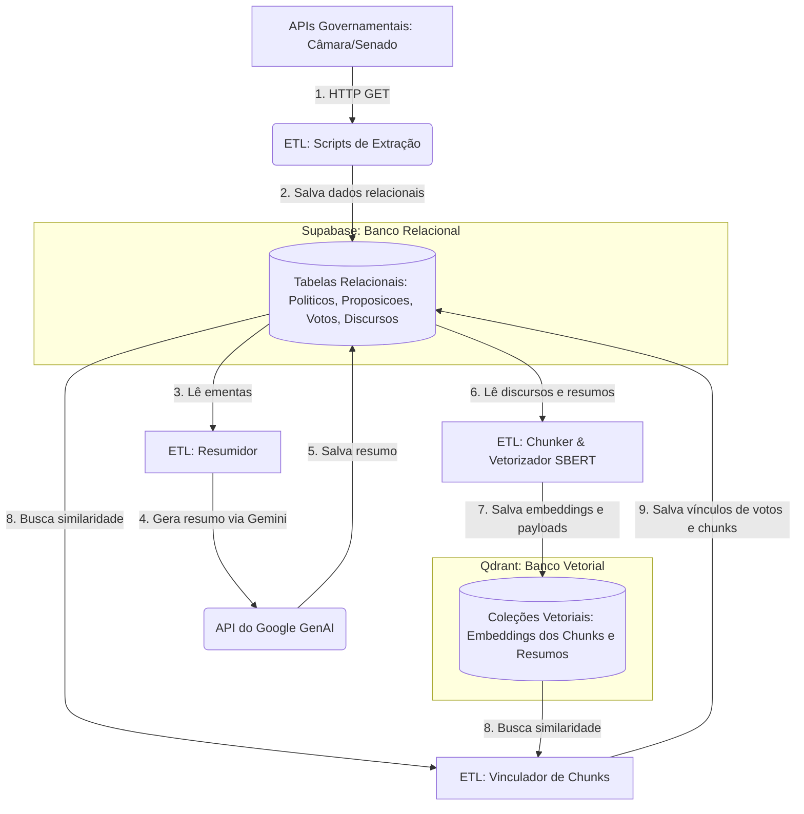

# O Mapa do ETL: Ingestão, Higienização e Carga

Este documento detalha a arquitetura da camada de Extração, Transformação e Carga (ETL) do **ContraDito**. Este módulo engloba as rotinas de Ingestão Relacional (Supabase) e Ingestão Vetorial (Qdrant) no lado *Command* do CQRS.

O objetivo desta camada é garantir a ingestão robusta de discursos, proposições e votos nominais, aplicando higienização extrema para blindar os modelos de embeddings (SBERT) e resumos (Google GenAI) contra ruídos semânticos e burocráticos.

---

## 1. Ciclo de Vida do Dado e Arquitetura

O dado nasce bruto nos servidores do Governo Federal (APIs federais da Câmara e do Senado), é ingerido diretamente na base relacional Supabase e, posteriormente, processado em lotes assíncronos de IA para a geração de resumos executivos, vetorização e vinculação semântica.

---

## 2. Escopo e Endpoints Consumidos

A arquitetura consome as APIs de Dados Abertos oficiais do Governo Federal, filtrando as informações para a Legislatura 57 (2023–2026).

### A. Câmara dos Deputados (`dadosabertos.camara.leg.br/api/v2`)

| Endpoint | Finalidade |
|---|---|
| `GET /deputados` | Perfis cadastrais dos deputados federais (titulares e suplentes). |
| `GET /proposicoes` | Mapeamento e ementas de PECs, PLs e PLPs votados. |
| `GET /votacoes/{id}/votos` | Registros de votos nominais ("Sim" ou "Não") por parlamentar. |
| `GET /deputados/{id}/discursos` | Notas taquigráficas brutas dos pronunciamentos. |

---

### B. Senado Federal (`legis.senado.leg.br/dadosabertos`)

| Endpoint | Finalidade |
|---|---|
| `GET /senador/lista/legislatura/57` | Perfis cadastrais de todos os senadores em exercício. |
| `GET /processo` | Listagem de matérias deliberadas (PL, PEC, PLS, etc.). |
| `GET /processo/{id}` | Detalhes e inteiro teor da matéria legislativa. |
| `GET /votacao` | Resultado e votos nominais detalhados de cada matéria. |
| `GET /senador/{id}/discursos` | Discursos e pronunciamentos oficiais proferidos em plenário. |

---

## 3. Regras de Negócio e Transformação (Isolamento de Mérito)

Para que a busca semântica via SBERT e a associação de votos funcionem corretamente, o pipeline ETL aplica filtros automatizados na ingestão para isolar o mérito real das proposições e evitar falsos positivos de votações meramente regimentais.

### A. Câmara dos Deputados
*   **Filtro de Manobras Regimentais (Blocklist):** Descarta automaticamente votações contendo termos como: `requerimento`, `preferência`, `redação final`, `adiamento`, `interstício`, `retirada de pauta`.
*   **Identificação de Votação Nominal (Allowlist):** A votação só é considerada de mérito caso registre a contagem explícita de votos no formato eletrônico padrão: `sim: <quantidade>; não: <quantidade>`.

### B. Senado Federal
*   **Filtro de Manobras Regimentais (Blocklist):** Descarta sessões legislativas com termos procedimentais: `requerimento`, `urgência`, `adiamento`, `destaque`, `questão de ordem`, `preferência`.
*   **Identificação de Votação de Mérito (Allowlist):** Exige termos indicativos de mérito de votação de lei no título ou descrição: `texto-base` / `texto base`, `substitutivo`, `parecer`, `1º turno`, `turno único`, `2º turno`.

### C. Higienização de Discursos (Regex e BeautifulSoup)
*   **Limpeza Estrutural:** Uso do `BeautifulSoup` para desinfetar o texto de tags HTML ocultas.
*   **Remoção de Ruídos:** Uso de Expressões Regulares para limpar marcações de tempo, nomes de oradores fixos, metadados da ata taquigráfica e reações descritas do plenário (ex: `[Risos]`, `(Pausa)`, `Apoiados`).
*   **Jargões Burocráticos:** Descarte de cumprimentos taquigráficos sem valor semântico (ex: *"Sr. Presidente, Sras. e Srs. Deputados..."*).

---

## 4. Rotina de Execução (Pipelines e Scripts)

O pipeline ETL é executado via scripts independentes no contêiner do Worker:

- **Carga Histórica (Seeding):** Execução única realizada pelos scripts de extração e processamento para povoar o Supabase e o Qdrant com dados retroativos a partir de 2023.
- **Carga Delta e Atualização:** Executados conforme demanda.