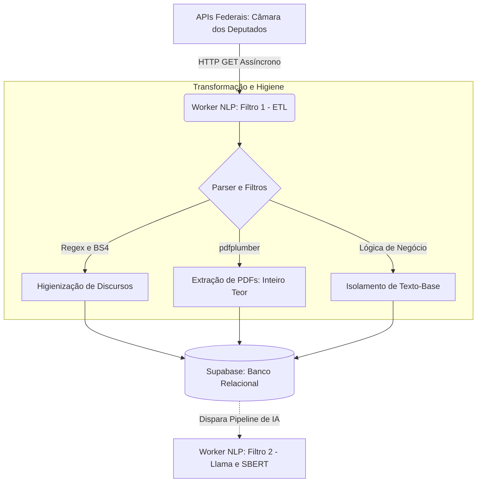

# O Mapa do ETL: Ingestão, Higienização e Carga (Filtro 1)

Este documento detalha a arquitetura da camada de Extração, Transformação e Carga (ETL) do **ContraDito**. Conforme a **ADR 002**, este módulo atua como o **Filtro 1** dentro do pipeline *Pipe and Filter* do Worker NLP (Lado *Command* do CQRS).

O objetivo desta camada é garantir a ingestão robusta de discursos, proposições e votos nominais, aplicando higienização extrema para blindar os modelos (SBERT e Llama 3.1) contra ruídos semânticos e burocráticos.

---

## 1. Ciclo de Vida do Dado e Arquitetura

O dado nasce bruto nos servidores do Governo Federal, é processado, limpo e tem seus PDFs extraídos em um script Python procedural. Após a persistência relacional, fica disponível para os próximos filtros do Worker NLP.

---

## 2. Escopo e Endpoints Consumidos

A arquitetura consome a infraestrutura de Dados Abertos da Câmara dos Deputados, com filtros rígidos de escopo (Legislatura 57: 2023 em diante).

### Câmara dos Deputados (`/api/v2`)

| Endpoint | Finalidade |
|---|---|
| `GET /deputados` | Perfis de titulares e suplentes (integridade de chaves estrangeiras). |
| `GET /proposicoes?siglaTipo=PEC,PL&ano=2023` | Mapeamento restrito às propostas centrais. |
| `GET /votacoes/{id_votacao}/votos` | Posicionamento nominal ("Sim"/"Não") por parlamentar. |
| `GET /deputados/{id}/discursos` | Transcrição bruta das falas em plenário e comissões. |

> **Inteiro Teor:** A URL do documento oficial é baixada e lida em texto plano via `pdfplumber`.

---

## 3. Estrutura de Dados Normalizada (Supabase)

| Tabela | Descrição da Carga |
|---|---|
| `POLITICOS` | Tabela primária: nome, partido, estado, status de mandato. Inclui suplentes para evitar erros de FK. |
| `PROPOSICOES` | Tipo, ementa e texto integral extraído do PDF da lei. |
| `VOTO` | Tabela associativa (N:M) relacionando parlamentar e proposição com posicionamento. |
| `DISCURSO` | Texto bruto higienizado e data do discurso. |

---

## 4. Regras de Negócio e Transformação

Para que a busca semântica via SBERT funcione corretamente, o ETL aplica duas camadas de blindagem:

### A. Higienização de Discursos (Regex e BeautifulSoup)

- **Limpeza Estrutural:** `BeautifulSoup` remove tags HTML invisíveis.
- **Expressões Regulares:** Remoção de timestamps, metadados taquigráficos e reações do plenário (`[Risos]`, `(Pausa)`).
- **Jargões Burocráticos:** Exclusão de frases não-semânticas como *"Sr. Presidente, peço a palavra"*.

### B. Isolamento de Votações (Antiduplicidade)

O script analisa a descrição do objeto da votação no JSON da Câmara:

- São retidas apenas votações com terminologia **"Texto-base"**, **"Redação Final"** ou **"1º Turno Substitutivo"**.
- Emendas supressivas, urgências e destaques são descartados na origem, impedindo votos divergentes para a mesma proposição.

---

## 5. Rotina de Execução (Cron Jobs)

O pipeline ETL é o gatilho do ecossistema assíncrono do Worker NLP:

- **Carga Histórica (Seeding):** Execução única varrendo Jan/2023 até o presente, criando a fundação relacional.
- **Carga Delta (Rotina Contínua):**
    - **Frequência:** Semanal — toda sexta-feira, às 03h00.
    - **Justificativa:** As atividades legislativas ocorrem primariamente de terça a quinta-feira. Executar na sexta de madrugada garante que a base esteja 100% atualizada para o pico de acessos do fim de semana.