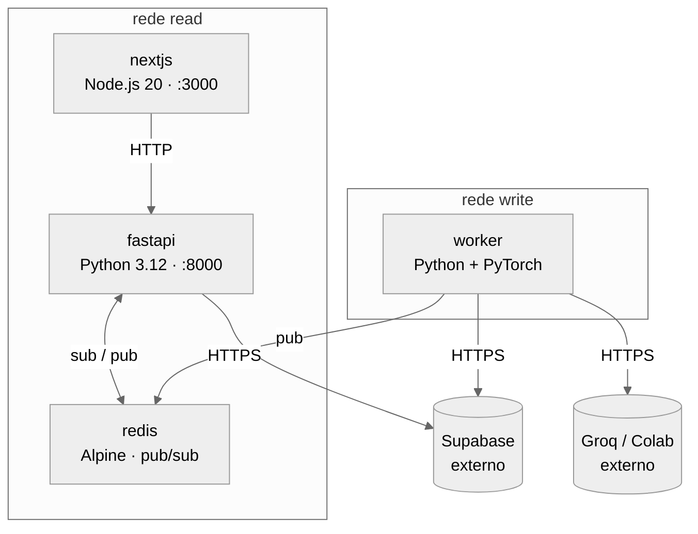

# Manual de Arquitetura Docker — ContraDito

Este documento descreve as decisões arquiteturais que governam a infraestrutura Docker do ContraDito e fornece o guia de execução local.

---

## 1. Visão Geral da Orquestração

A infraestrutura do ContraDito é orquestrada inteiramente via Docker Compose. O banco de dados **não é um contêiner** — o Supabase é um serviço externo gerenciado. Toda a persistência de dados é responsabilidade da plataforma Supabase.

Os contêineres locais são exatamente quatro:

| Contêiner | Tecnologia | Porta exposta no host |
|---|---|---|
| `nextjs` | Next.js (Node.js 20) | `3000` |
| `fastapi` | FastAPI (Python 3.12) | `8000` |
| `worker` | Python 3.12 + PyTorch + BAAI/bge-m3 | **Nenhuma** |
| `redis` | Redis Alpine | **Nenhuma** |

O Worker não expõe portas. Ele é disparado por cron job e opera completamente isolado do tráfego web. O Redis também não expõe portas no host — é exclusivamente um canal interno de comunicação assíncrona.

---

## 2. Decisões Arquiteturais Docker

### 2.1 Isolamento de rede obrigatório (CQRS)

O sistema é dividido em dois lados que nunca se comunicam diretamente. Essa separação é garantida pela **topologia de redes Docker**, não apenas por convenção de código. A orquestração define três redes internas:

- **Rede `read`**: conecta `nextjs` ↔ `fastapi` ↔ `redis`. Nenhum outro serviço pertence a essa rede.
- **Rede `write`**: conecta `worker` ↔ `redis`. O Worker acessa o Supabase e o Motor de Inferência via egress HTTPS — não via rede interna Docker.
- O `redis` pertence **a ambas as redes** — é o único ponto de contato entre os dois lados, exclusivamente como canal assíncrono de sinalização.

A `fastapi` **não pertence à rede `write`** e, portanto, não tem rota de rede para o `worker` nem para nenhum endpoint do Motor de Inferência. Worker e FastAPI nunca se enxergam diretamente — a topologia torna isso impossível, não apenas improvável.



### 2.2 Banco de dados externo — sem contêiner PostgreSQL

Não existe e não deve existir um contêiner PostgreSQL no `docker-compose.yml`. O banco é o Supabase, exclusivamente.

FastAPI e Worker acessam o banco via variáveis de ambiente `SUPABASE_URL` e `SUPABASE_KEY`.

> Para detalhes sobre o Supabase como plataforma, pgvector e o modelo de persistência, consulte a [aba de Arquitetura](arquitetura.md).

### 2.3 Motor de Inferência externo — troca de provedor via `.env`

O Motor de Inferência não é um contêiner local. O provedor é selecionado por uma única variável de ambiente `LLM_PROVIDER`, **sem nenhuma alteração em Dockerfile ou `docker-compose.yml`**.

O Worker acessa o provedor exclusivamente via egress HTTPS a partir da rede `write`.

> Para detalhes sobre os provedores (Groq, Colab/Ollama), cenários de uso e estratégia híbrida, consulte a [aba de Arquitetura](arquitetura.md).

### 2.4 Volumes — cache HuggingFace

O modelo `BAAI/bge-m3` (~2,3 GB de pesos) é baixado automaticamente via HuggingFace na primeira execução do Worker. Para evitar redownload a cada rebuild, os pesos devem ser persistidos em volume Docker:

- Caminho interno no contêiner: `/root/.cache/huggingface`
- Volume nomeado: `huggingface_cache`

O volume deve sobreviver a `docker compose down` seguido de `docker compose up`.

O Redis **não utiliza volume de persistência**. Seu papel na orquestração é exclusivamente o de canal Pub/Sub de sinalização — não armazena dados de negócio. Se o contêiner reiniciar entre ciclos do Worker, a FastAPI simplesmente não recebe o sinal naquele ciclo e continua servindo o cache atual até a próxima invalidação. Nenhum dado crítico é perdido.

### 2.5 Dockerfile do Worker — layer caching para builds ágeis

O Dockerfile do Worker separa as dependências pesadas do código-fonte em camadas distintas. A ordem de instruções segue a lógica de frequência de mudança (do que muda menos para o que muda mais):

1. Imagem base Python 3.12
2. Dependências de sistema (se houver)
3. Dependências de IA: PyTorch, Sentence-Transformers, LangChain — camada isolada
4. Dependências de parsing de PDF: `pdfplumber` ou `pymupdf`
5. Demais dependências Python
6. Código-fonte da aplicação

Essa estrutura garante que uma alteração no código da aplicação não invalide as camadas pesadas de IA, que raramente mudam. O `.dockerignore` deve excluir ativamente artefatos de desenvolvimento local (`.git`, `__pycache__`, ambientes virtuais, etc.).

### 2.6 Contenção de recursos

O Worker executa NLP intensivo — carrega o modelo de embedding em memória e processa batches. Para que isso não degrade a FastAPI e o Next.js, **limites de CPU e memória devem ser definidos por contêiner** via a chave `deploy.resources` no `docker-compose.yml`:

```yaml
deploy:
  resources:
    limits:
      cpus: "2.0"
      memory: 4G
```

Os valores acima são ilustrativos — serão calibrados na etapa de implementação conforme a máquina host. Em desenvolvimento local com Apple Silicon, definir esse teto é especialmente importante: sem ele, a vetorização do PyTorch pode consumir todos os núcleos disponíveis e degradar o ambiente inteiro durante o processamento.

### 2.7 Healthchecks e ordem de inicialização

Como o banco é externo, não há dependência de inicialização de contêiner de banco. A ordem relevante é:

- `redis` deve subir primeiro — é pré-requisito tanto da `fastapi` quanto do `worker`
- `fastapi` aguarda o `redis` estar saudável antes de aceitar tráfego
- `nextjs` aguarda a `fastapi` estar saudável antes de aceitar tráfego
- `worker` aguarda o `redis` estar saudável antes de executar o pipeline

Uma falha no `worker` não deve derrubar o Lado de Leitura. A FastAPI continua servindo dados do cache em memória normalmente mesmo quando o Worker está parado ou falhando.

### 2.8 Invalidação de cache — Redis Pub/Sub

A invalidação do cache em memória da FastAPI é realizada via **Redis Pub/Sub**. O fluxo é assíncrono e respeita o isolamento CQRS — Worker e FastAPI nunca se comunicam diretamente.

O mecanismo funciona da seguinte forma: ao fim de cada ciclo do pipeline (após persistir os dados no Supabase), o Worker publica uma mensagem em um canal Redis. A FastAPI mantém um subscriber assíncrono escutando esse canal e, ao receber a mensagem, descarta o cache em memória. O próximo request do Next.js receberá dados frescos consultados diretamente do Supabase.

Essa abordagem foi escolhida por preservar o isolamento arquitetural sem introduzir chamada HTTP direta entre os dois lados da orquestração.

### 2.9 Premissa de Desenvolvimento Local e Produtividade (Hot-Reload)

Embora a orquestração isole rigidamente os serviços em contêineres, o ambiente local de desenvolvimento deverá ser configurado utilizando bind mounts (mapeamento de volumes locais para os contêineres). Isso garantirá que as modificações feitas no código-fonte do Next.js e da FastAPI na máquina hospedeira sejam refletidas instantaneamente dentro dos contêineres, mantendo o Hot-Reload ativo e eliminando qualquer necessidade de rebuilds contínuos do Docker durante o ciclo de codificação.

---

## 3. Variáveis de Ambiente relevantes para a orquestração

As variáveis abaixo afetam diretamente o comportamento dos contêineres. O arquivo `.env` completo com descrições de negócio está documentado na aba de Arquitetura no MkDocs.

```env
# Supabase — banco de dados gerenciado (obrigatório para FastAPI e Worker)
SUPABASE_URL=
SUPABASE_KEY=

# Motor de Inferência — seletor de provedor (obrigatório para Worker)
LLM_PROVIDER=          # "groq" ou "colab"
GROQ_API_KEY=          # obrigatório quando LLM_PROVIDER=groq
OLLAMA_BASE_URL=       # obrigatório quando LLM_PROVIDER=colab — atualizar a cada sessão

# Redis — canal de invalidação de cache (obrigatório para FastAPI e Worker)
REDIS_URL=redis://redis:6379

# Front-end
NEXT_PUBLIC_API_URL=http://localhost:8000
```

> **Atenção:** `OLLAMA_BASE_URL` não deve ter valor padrão. A ausência de valor quando `LLM_PROVIDER=colab` deve gerar erro explícito no Worker, não falha silenciosa. `REDIS_URL` é consumida tanto pela FastAPI (subscriber) quanto pelo Worker (publisher) — ambos devem falhar explicitamente se a variável estiver ausente.

---

## 4. Guia de Execução Local

> ⚠️ **Aviso sobre Arquitetura (Apple Silicon / ARM64)**
>
> Os contêineres, especialmente o `worker` que executa PyTorch e carrega o modelo `BAAI/bge-m3`, devem rodar nativamente na arquitetura `linux/arm64`. O Docker Desktop faz isso por padrão, mas certifique-se de que a emulação do Rosetta 2 não está sendo acionada silenciosamente.
>
> O PyTorch rodará utilizando a CPU nativa (aarch64). O Docker no Mac atualmente não possui suporte a passthrough para utilizar a GPU (MPS) da Apple.
>
> A diretriz `platform: linux/arm64` deve estar configurada no `docker-compose.yml` para desenvolvimento local. Isso evita fallbacks para imagens emuladas lentas (amd64), o que causaria gargalos severos de performance e estouro de memória durante a vetorização do backfill.

### Passo 1 — Clonar o repositório

```bash
git clone https://github.com/SeuUsuario/ContraDito.git
cd ContraDito
git checkout main
```

### Passo 2 — Configurar o `.env`

Crie o arquivo `.env` na raiz do projeto conforme a seção 3. Defina ao menos `SUPABASE_URL`, `SUPABASE_KEY`, `LLM_PROVIDER` e `REDIS_URL` antes de subir os contêineres.

### Passo 3 — Subir o ambiente

```bash
docker compose up --build
```

Na primeira execução, o Docker irá:

1. Construir as imagens customizadas (FastAPI e Worker)
2. Baixar as imagens base (Node.js 20, Python 3.12)
3. Instalar as dependências — as camadas de IA do Worker são as mais pesadas e demoradas
4. Baixar os pesos do `BAAI/bge-m3` (~2,3 GB) para o volume `huggingface_cache`

A partir da segunda execução, o Layer Caching e o volume HuggingFace eliminam esses custos — o ambiente sobe significativamente mais rápido.

Ao final, os seguintes endereços estarão disponíveis:

- **Interface do usuário:** http://localhost:3000
- **Documentação da API (Swagger):** http://localhost:8000/docs

### Passo 4 — Derrubar o ambiente

```bash
# Derruba os contêineres e remove redes residuais
docker compose down
```

O volume `huggingface_cache` é preservado. Para remover também os volumes:

```bash
docker compose down -v
```

> **Atenção:** `down -v` apaga os pesos do modelo. A próxima execução com `up --build` fará o redownload dos ~2,3 GB.

---

## 5. Executar o Worker Manualmente

O Worker é disparado pelo cron do sistema operacional do servidor — não fica em execução contínua. A cada ciclo, o host executa `docker compose run`, o contêiner nasce, processa e encerra. Isso significa que o Worker não consome memória em background entre os ciclos.

Para executar o pipeline manualmente durante o desenvolvimento:

```bash
docker compose run --rm worker python main.py
```

---

## 6. Restrições que Nunca Devem Ser Violadas

| Restrição | Razão |
|---|---|
| FastAPI sem rota de rede para o Motor de Inferência | Isolamento CQRS — garantido por topologia Docker |
| Worker sem rota de rede direta para a FastAPI | Isolamento CQRS — comunicação ocorre exclusivamente via Redis |
| Next.js sem acesso direto ao Supabase | Todo acesso ao banco passa pela FastAPI |
| Nenhum contêiner PostgreSQL local | O banco é o Supabase |
| Redis sem porta exposta no host | Canal interno — não deve ser acessível fora da orquestração |
| Redis sem volume de persistência | Canal de sinalização efêmero — não armazena dados de negócio |
| Troca de provedor LLM apenas via `.env` | Sem alterações em Dockerfile ou `docker-compose.yml` |
| Modelo de embedding fixo: `BAAI/bge-m3` | Consistência do espaço vetorial com os dados já no Supabase |
| Worker sem portas expostas no host | Isolamento de processamento pesado do tráfego web |