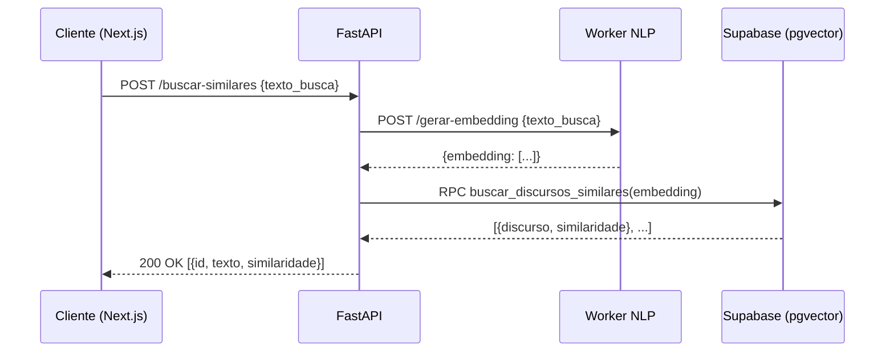

# Integração e API (Rotas e Swagger)

A API do ContraDito foi construída com **FastAPI**, focada em alta performance, respostas cacheadas e processamento assíncrono.

---

## 1. Documentação Interativa (Swagger)

Com os contêineres em execução, toda a documentação de *schemas*, contratos e testes de rotas está disponível automaticamente:

| Interface | URL |
|---|---|
| **Swagger UI** | `http://localhost:8000/docs` |
| **ReDoc** | `http://localhost:8000/redoc` |

---

## 2. Domínio: Políticos (`/api/politicos`)

### `GET /api/politicos` — Listar e Filtrar

Retorna uma listagem paginada de parlamentares. A rota utiliza **cache em memória de 1 hora** para garantir carregamento rápido da página inicial.

**Parâmetros de Query (Opcionais):**

| Parâmetro | Tipo | Descrição |
|---|---|---|
| `busca` | `string` | Pesquisa parcial por nome de urna. |
| `partido` | `string` | Partido político (`PT`, `PL`, etc.). |
| `cargo` | `string` | Cargo parlamentar (`DEPUTADO`, `SENADOR`). |
| `uf` | `string` | Unidade federativa (`SP`, `RJ`). |
| `ordem` | `string` | `mais_coerentes` ou `menos_coerentes`. |
| `pagina` | `int` | Página atual da paginação. |

**Retorno de Sucesso (`200 OK`):**

```json
{
  "total_registros": 513,
  "pagina_atual": 1,
  "tamanho_pagina": 20,
  "total_paginas": 26,
  "itens": [
    {
      "id": 1,
      "nome_urna": "Fulano",
      "score_coerencia": 85.5,
      "uf": "SP"
    }
  ]
}
```

---

### `GET /api/politicos/{id_parlamentar}` — Perfil Detalhado

Rota consumida na tela individual do parlamentar. Retorna dados cadastrais e o histórico completo de análises semânticas e provas de contradição.

**Retorno de Sucesso (`200 OK`):**

```json
{
  "politico": {
    "id": 1,
    "nome_urna": "Fulano",
    "cargo": "DEPUTADO",
    "score_coerencia": 85.5
  },
  "provas": [
    {
      "id": 10,
      "contexto": {
        "tipo_documento": "DISCURSO",
        "data_evento": "2024-05-10",
        "texto_extraido": "Sempre fui a favor do teto de gastos..."
      },
      "resultado": {
        "topico_identificado": "Economia",
        "postura_extraida_do_texto": "A Favor",
        "justificativa": "O parlamentar defende explicitamente o limite.",
        "voto_oficial_registrado": "Contra",
        "status_coerencia": false
      }
    }
  ]
}
```

**Erros:**

| Status | Cenário |
|---|---|
| `404 Not Found` | `id_parlamentar` não encontrado no banco. |

---

## 3. Domínio: Busca Semântica (`/api/politicos/buscar-similares`)

### `POST /api/politicos/buscar-similares` — Busca RAG

Esta rota representa o núcleo de Busca Semântica do sistema. Em vez de executar NLP diretamente na API, a geração de embeddings é delegada ao Worker assíncrono.

**Fluxo de Execução:**



**Corpo da Requisição:**

```json
{
  "texto_busca": "Aumento do limite de gastos governamentais",
  "id_parlamentar": 1,
  "limite": 5
}
```

**Retorno de Sucesso (`200 OK`):**

```json
[
  {
    "id": 45,
    "texto_extraido": "Meu voto sempre foi favorável ao teto...",
    "similaridade": 0.85
  },
  {
    "id": 102,
    "texto_extraido": "É preciso responsabilidade fiscal...",
    "similaridade": 0.78
  }
]
```

**Erros:**

| Status | Cenário |
|---|---|
| `400 Bad Request` | Falha na geração do embedding pelo Worker NLP. |
| `503 Service Unavailable` | Worker NLP offline ou timeout > 15 segundos. |