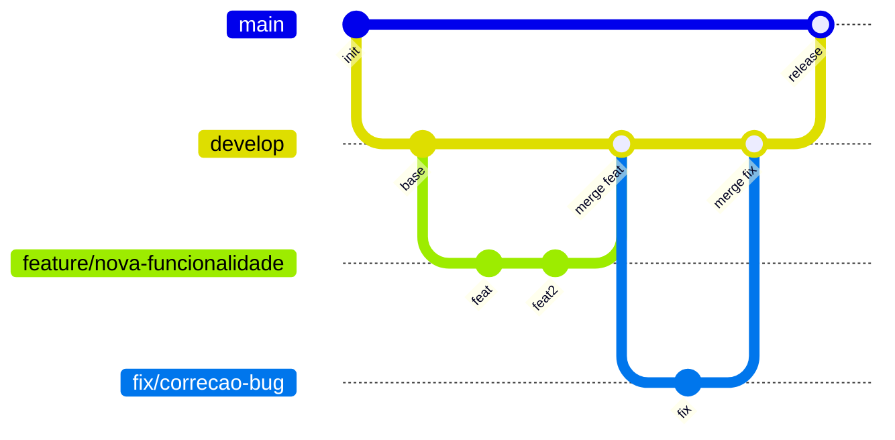

# Metodologia e Processo de Desenvolvimento

Este documento descreve as práticas ágeis, os ritos e as políticas de engenharia de software adotadas pela **Squad 09** para o desenvolvimento do ContraDito.

---

## 1. Framework Ágil

A equipe adota uma abordagem híbrida baseada em **Scrum** e **Extreme Programming (XP)**. O Scrum estrutura a cadência e o planejamento das Sprints, enquanto os valores do XP guiam as práticas de engenharia e o foco na qualidade técnica do código.

---

## 2. Papéis da Equipe

| Papel | Responsável | Responsabilidades |
|---|---|---|
| **Scrum Master** | @henriquemendeselias | Remover impedimentos e garantir a execução dos ritos ágeis. |
| **Product Owner** | @jot4-ge | Refinar e priorizar o Backlog, definir escopo e validar entregas. |
| **Backend e DevOps** | @luizhtmoreira, @lucasaraujoszz, @matheus0346 | Pipeline ETL, motor NLP, modelagem do banco vetorial e infraestrutura. |
| **Frontend** | @G2SBiell | Interface do usuário (Next.js/React), integração com a API e fidelidade ao UX. |

---

## 3. Ritos e Cadência

Trabalhamos com **Sprints de 1 semana**:

- **Planning:** Terças-feiras — priorização de Issues e estimativa de esforço.
- **Dailies:** Assíncronas via Discord/WhatsApp.
- **Review e Retrospectiva:** Ao final de cada Sprint.

---

## 4. Práticas de Engenharia (XP)

- **Code Review:** Nenhum código entra na branch `develop` sem revisão. PRs exigem aprovação de ao menos um outro membro da equipe.
- **Integração Contínua (CI):** Pipelines no GitHub Actions para rodar linters (`black`) e testes automatizados a cada commit.
- **Pair Programming:** Utilizado em tarefas de alta complexidade ou decisões arquiteturais sensíveis, para mitigar gargalos e compartilhar conhecimento técnico.

---

## 5. Política de Repositório (GitFlow)

| Branch | Finalidade |
|---|---|
| `main` | Código em produção (versões estáveis). |
| `develop` | Código em integração (ambiente de homologação). |
| `feature/[nome]` | Branches efêmeras para novas funcionalidades. |
| `fix/[nome]` | Branches específicas para correção de erros. |
