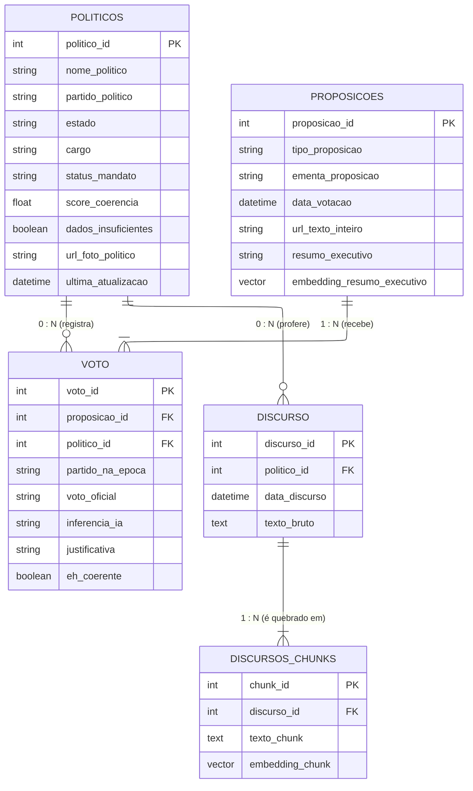

# Modelagem do Banco de Dados

O modelo do banco (Supabase/PostgreSQL) foi desenhado para suportar o padrão **CQRS** e otimizar as consultas de **RAG** usando a extensão `pgvector`.

---

## 1. Diagrama de Entidade-Relacionamento (ERD)

O diagrama ilustra as entidades, suas chaves e cardinalidades, isolando o motor vetorial da API principal.

---

## 2. Descrição das Entidades

| Tabela | Papel no Sistema |
|---|---|
| **POLITICOS** | Tabela de consulta do Lado de Leitura (FastAPI). Minimiza processamento em tempo de execução. |
| **PROPOSICOES** | Armazena os textos-base de matérias votadas em plenário (PECs e PLs), incluindo o `embedding_resumo_executivo`. |
| **VOTO** | Tabela associativa (N:M) entre parlamentares e leis. Armazena também a inferência da IA e o veredito. |
| **DISCURSO** | Massa textual bruta extraída das notas taquigráficas da API da Câmara. |
| **DISCURSOS_CHUNKS** | Fragmentos textuais processados pelo *Text Splitter*, com seus respectivos `embedding_chunk` para busca RAG. |

---

## 3. Análise das Cardinalidades

A consistência matemática baseia-se na distinção entre relações opcionais e obrigatórias:

- **POLITICOS → VOTO e DISCURSO:** Relação opcional — um parlamentar suplente pode não ter votos nem discursos.
- **PROPOSICOES → VOTO:** Relação obrigatória — pelo escopo do ETL, só são extraídas proposições com votação registrada.
- **DISCURSO → DISCURSOS_CHUNKS:** Relação obrigatória — um chunk só existe se seu discurso pai existir.

---

## 4. Banco de Dados como Motor Ativo

Para não sobrecarregar a memória da aplicação, a modelagem transfere a carga de processamento para o banco com duas abordagens:

- **Busca Semântica (RAG):** Buscas vetoriais via `pgvector` localizam os trechos de discurso mais relevantes para cada proposição analisada, usando o índice HNSW para alta performance.
- **Separação CQRS:** O processamento pesado da IA ocorre isolado no Worker NLP. A FastAPI consulta apenas dados já consolidados — sem cálculos vetoriais em tempo de request do usuário.
