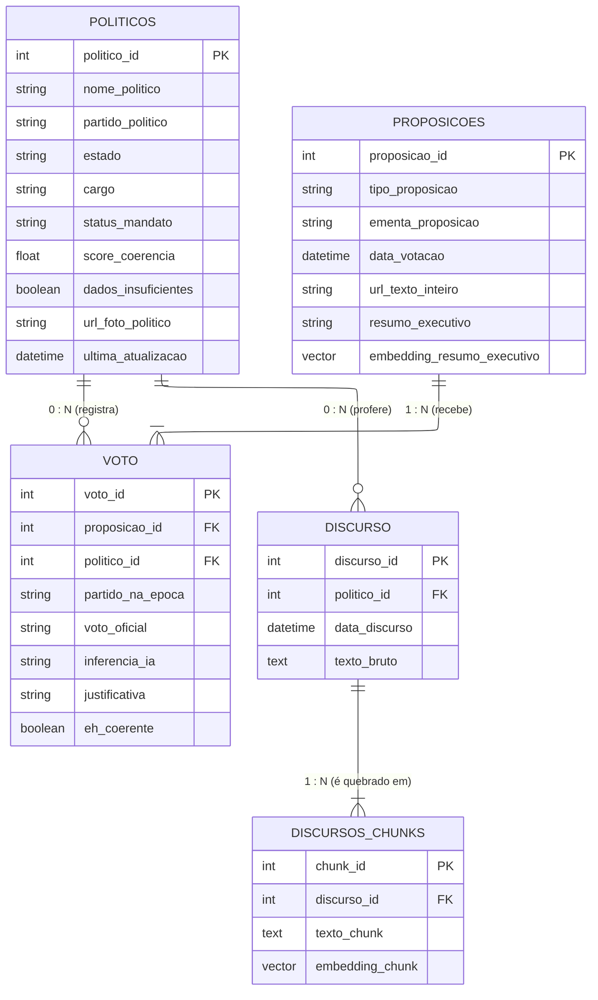

# Modelagem do Banco de Dados

O modelo do banco (supabase) foi desenhado para suportar o padrão **CQRS** (segregação de leitura e escrita) e otimizar as consultas de **RAG** (Geração Aumentada por Recuperação) usando a extensão `pgvector`.

---

## 1. Diagrama de Entidade-Relacionamento (ERD)

O diagrama abaixo ilustra as entidades do sistema, suas chaves primárias/estrangeiras e as cardinalidades exatas que governam a integridade dos dados, isolando o motor vetorial da API principal.

 - **Tabela POLITICOS:** Tabela puramente de consulta para o lado de leitura (Query) da API FastAPI, minimizando processamento em tempo de execução.

 - **Tabela PROPOSICOES:** Armazena os textos-base das matérias legislativas que foram formalmente votadas em plenário (PECs e PLs).

 - **Tabela VOTO:** Tabela associativa que resolve a relação Muitos-para-Muitos (N:M) entre Parlamentares e Leis.

 - **Tabela DISCURSO:** Armazena a massa de dados bruta extraída das notas taquigráficas da API da Câmara.

- **Tabela DISCURSOS_CHUNKS:** Armazena os fragmentos textuais processados pelos algoritmos de divisão de texto (*Text Splitters*).

---

## 2. Análise das Cardinalidades

A consistência matemática do banco baseia-se na distinção estrita entre relações opcionais e obrigatórias:

- **Relação de POLITICOS com VOTO e DISCURSO:** Um parlamentar pode não ter votos e nem discursos (Suplentes). Relação opcional.

- **Relação de PROPOSIÇÕES com VOTO:** O escopo define que só é extraído proposições com votações, portanto a relação é obrigatória.

- **Relação de DISCURSOS com DISCURSOS_CHUNKS:** Um chunk de discurso só existe se seu discurso existir. Relação obrigatória.

---

## 3. Banco de Dados como Motor Ativo 
Pra nao sobrecarregar a memória da aplicação, a nossa modelagem transfere a carga de processamento para o banco com duas abordagens:

* **Busca Inteligente de Contexto:** O sistema utiliza buscas semânticas para encontrar os trechos de discursos mais relacionados com cada proposta analisada.

* **Separação entre Processamento e Consulta (CQRS):** O processamento pesado da IA acontece de forma isolada no Worker NLP, enquanto a API principal apenas consulta dados já processados e prontos para exibição. Isso garante que a interface continue rápida mesmo durante análises complexas.
