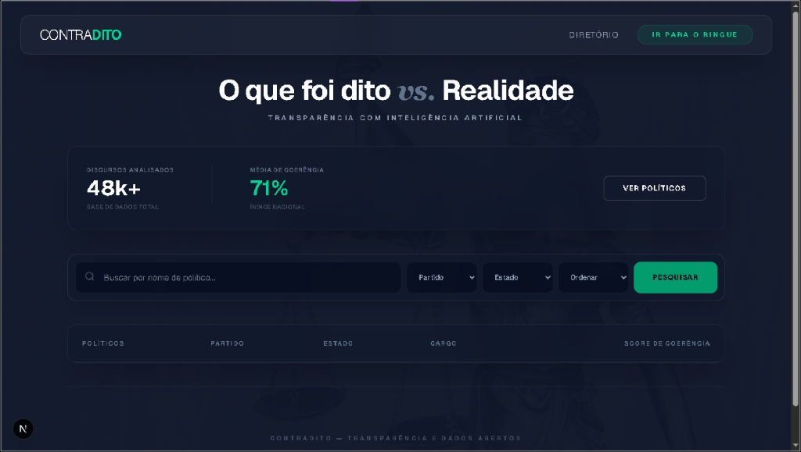

# Protótipos e UI/UX (Figma)

A interface do **ContraDito** foi idealizada seguindo o princípio de **Mobile First**, garantindo uma experiência de fiscalização pública fluida e intuitiva em qualquer dispositivo.

---

## O "Ringue" (Comparação Lado a Lado)

Uma das inovações de UX do projeto é a tela de comparação:

- **Desktop:** Layout de tela dividida (*split screen*) — dois políticos visíveis ao mesmo tempo.
- **Mobile:** Dados empilhados de forma inteligente, mantendo o contexto da comparação sem prejudicar o uso.

---

## Protótipos de Alta Fidelidade

As telas principais do sistema, conforme projetadas no Figma:

### Tela Inicial e Busca

### Comparação (O Ringue)

