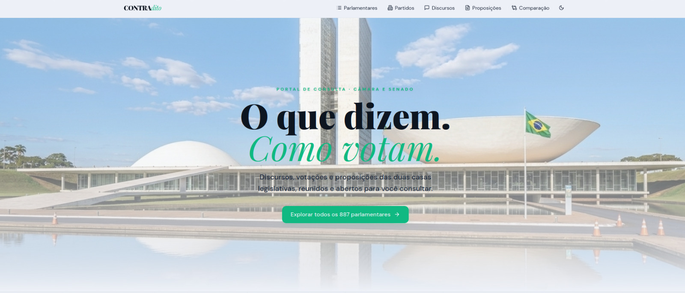
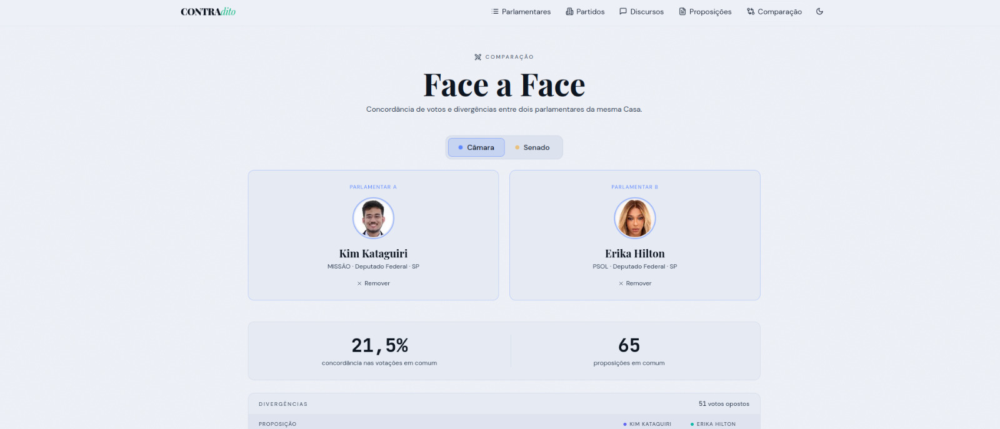
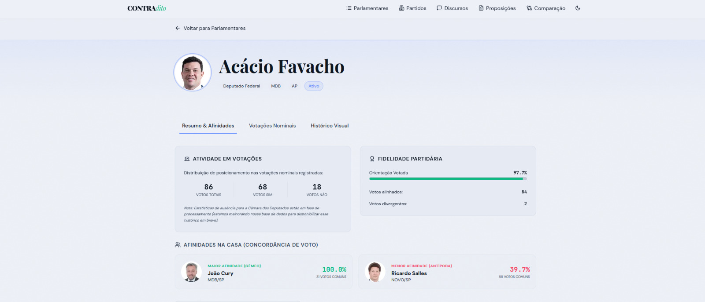
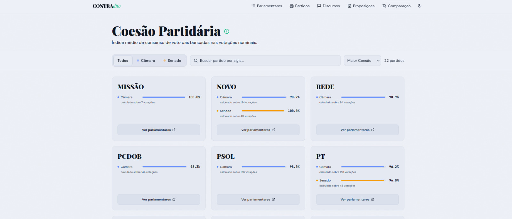
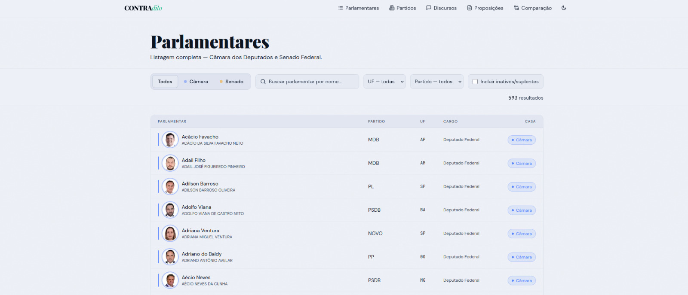
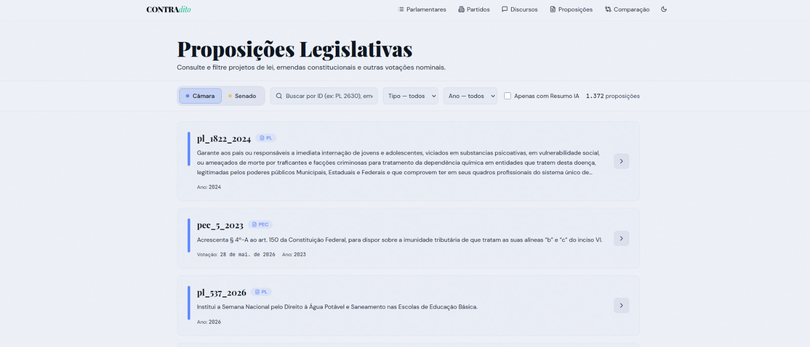
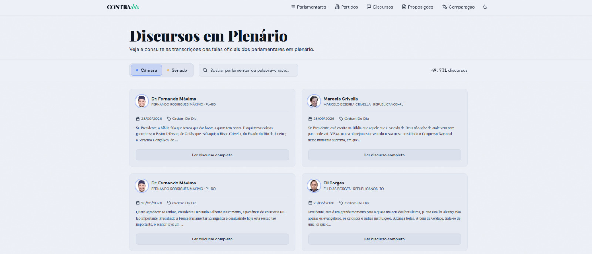

# Protótipos e UI/UX (Figma)

* **Design e Protótipos (Figma):** [Acessar Board no Figma](https://www.figma.com/board/J6igyv5zX16YPhLaoKM3c4/ContraDito?node-id=0-1&t=Jq1ENqM8V4La6slk-0)

## Protótipos de Alta Fidelidade

As telas principais do sistema, conforme projetadas no Figma:

### Tela Inicial e Busca

### Comparação (O Ringue)

### Dossiê Político

### Coesão Partidária

### Lista de Parlamentares

### Proposições Legislativas

### Transcrições dos Discursos em plenários

